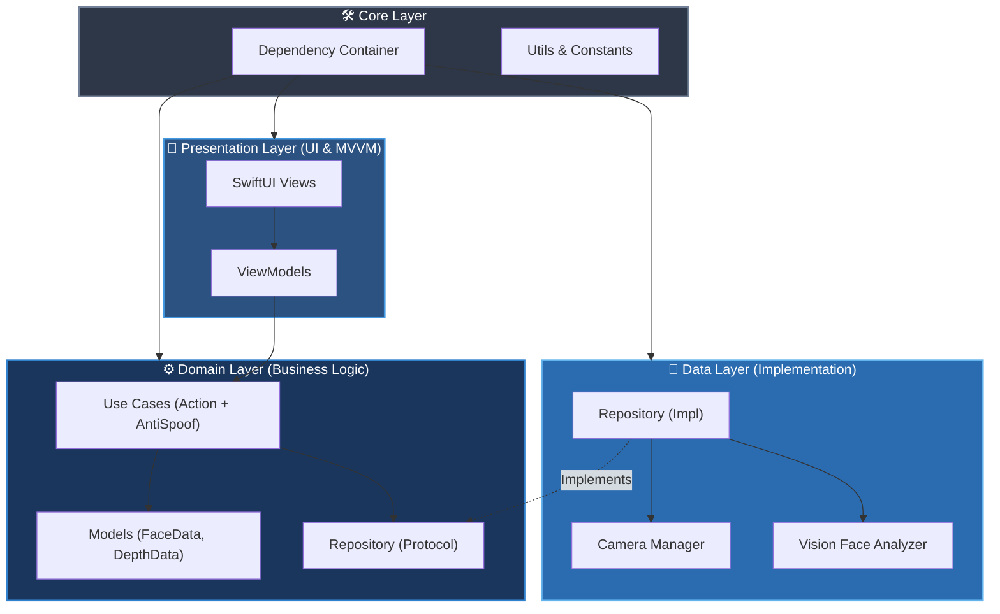

# SDKLiveness SDK — Clean Architecture Structure

เอกสารนี้อธิบายโครงสร้างของโปรเจค **SDKLiveness SDK** ซึ่งถูกออกแบบและพัฒนาโดยยึดหลัก **Clean Architecture** และ **MVVM** เพื่อให้โค้ดสามารถทดสอบได้ง่าย (Testable), บำรุงรักษาได้ง่าย (Maintainable) และลดการพึ่งพากันระหว่างแต่ละส่วน (Loose Coupling)

---

## 🏗️ Architecture Overview

โปรเจคถูกแบ่งออกเป็น 4 Layer หลัก ได้แก่:

1.  **Domain Layer:** หัวใจของแอป (Business Logic & Entities) — *อิสระที่สุด ไม่ขึ้นกับชั้นอื่น*
2.  **Data Layer:** การจัดการข้อมูลและ Hardware (Camera, Vision Framework) — *ขึ้นกับ Domain*
3.  **Presentation Layer:** หน้าจอผู้ใช้งาน (SwiftUI Views & ViewModels) — *ขึ้นกับ Domain*
4.  **Core Layer:** โค้ดพื้นฐานที่ถูกเรียกใช้จากทุก Layer (Constants, Extensions, DI)

### Dependency Rule Diagram

ทิศทางของ Dependency จะชี้เข้าหาชั้น Domain เสมอ (Inward Dependencies)



---

## 📂 Directory Structure

นี่คือโครงสร้างไฟล์ทั้งหมดในโปรเจค (จำนวน 55 ไฟล์ Swift) ที่จัดกลุ่มตาม Clean Architecture:

```text
SDK Liveness/
├── SDK_LivenessApp.swift                     // จุดเริ่มต้นของแอป (App Entry)
├── ContentView.swift                         // หน้าจอหลัก (เรียกใช้ Coordinator)
│
├── 🛠️ Core/                                  // โค้ดพื้นฐานที่ใช้ร่วมกัน
│   ├── Constants/
│   │   ├── AppConstants.swift                // ค่าคงที่ทั่วไป (Timeout, Config)
│   │   ├── LivenessThresholds.swift          // ค่าความไวในการตรวจจับ (EAR, Yaw, Pitch)
│   │   └── AntiSpoofThresholds.swift         // ค่า Threshold ตรวจจับการใช้รูปถ่าย (Depth Curvature)
│   ├── DI/
│   │   └── DependencyContainer.swift         // ตัวจัดการ Dependency Injection 
│   ├── Errors/
│   │   └── LivenessError.swift               // รวม Error ทุกประเภทของ SDK
│   ├── Extensions/                           // ส่วนขยายต่างๆ (Color, CGPoint, VNFaceObservation)
│   └── Utils/                                // เครื่องมือเสริม (HapticFeedback, Logger)
│
├── ⚙️ Domain/                                // Business Logic (ไม่ขึ้นกับ Framework ภายนอก)
│   ├── Models/
│   │   ├── FaceAnalysisData.swift            // ข้อมูลที่วิเคราะห์ได้ (รวมจาก Vision & Depth)
│   │   ├── DepthAntiSpoofData.swift          // ข้อมูลการตรวจสอบ TrueDepth (ความโค้งนูนของหน้า)
│   │   ├── HeadPose.swift                    // โครงสร้างมุมศีรษะ (Yaw, Pitch, Roll)
│   │   ├── EyeState.swift                    // สถานะดวงตา (EAR)
│   │   ├── SmileState.swift                  // สถานะการยิ้ม (Lip Ratio)
│   │   ├── LivenessAction.swift              // Enum ของ 4 ท่าทาง (หัน, กระพริบ, ยิ้ม, พยักหน้า)
│   │   ├── ActionResult.swift                // ผลลัพธ์ของแต่ละท่า
│   │   └── LivenessSessionConfig.swift       // การตั้งค่า Session
│   ├── Repository/
│   │   └── LivenessRepositoryProtocol.swift  // Interface ที่ตกลงกับชั้น Data (IoC)
│   └── UseCases/                             // กฎทางธุรกิจของแอป
│       ├── DetectFaceUseCase.swift           // ตรวจสอบว่าหน้าอยู่ในวงรีหรือไม่
│       ├── RunLivenessSessionUseCase.swift   // ผู้จัดการ Flow ของการทำ Liveness ทั้งหมด
│       ├── ValidateHeadTurnUseCase.swift     // ตรวจสอบการหันหน้า
│       ├── ValidateBlinkUseCase.swift        // ตรวจสอบการกระพริบตา
│       ├── ValidateSmileUseCase.swift        // ตรวจสอบการยิ้ม
│       ├── ValidateNodUseCase.swift          // ตรวจสอบการพยักหน้า
│       ├── ValidateAntiSpoofUseCase.swift    // ตรวจสอบการปลอมแปลงใบหน้าด้วยรูปถ่าย
│       └── ValidateLicenseUseCase.swift      // ตรวจสอบสิทธิ์การใช้งาน
│
├── 💾 Data/                                  // การติดต่อกับ Hardware และ ภายนอก
│   ├── Camera/
│   │   ├── CameraManagerProtocol.swift
│   │   └── CameraManager.swift               // จัดการ AVCaptureSession (ดึงภาพจากกล้อง)
│   ├── FaceAnalysis/
│   │   ├── VisionFaceAnalyzerProtocol.swift
│   │   ├── VisionFaceAnalyzer.swift          // จัดการ Apple Vision Framework
│   │   ├── DepthAntiSpoofAnalyzer.swift      // วิเคราะห์ความลึกจาก TrueDepth ป้องกันรูปถ่าย
│   │   ├── EyeAspectRatioCalculator.swift    // คำนวณ EAR จากจุดบนตา
│   │   └── SmileDetectorCalculator.swift     // คำนวณ Lip Ratio จากจุดบนปาก
│   ├── License/
│   │   └── LicenseValidator.swift            // การเชื่อมต่อระบบ License API
│   └── Repository/
│       └── LivenessRepositoryImpl.swift      // นำ Camera + Vision มารวมกันและส่งให้ Domain
│
└── 🎨 Presentation/                          // UI และการแสดงผล (MVVM)
    ├── Theme/
    │   ├── AppTheme.swift                    // สี ฟอนต์ ขนาด (Design Tokens)
    │   └── AnimationConstants.swift          // ค่าความเร็ว Animation
    ├── Components/                           // UI ที่ใช้ซ้ำได้
    │   ├── FaceOvalOverlay.swift             // กรอบวงรีบนหน้าจอ
    │   ├── ProgressBarView.swift             // แถบความคืบหน้า
    │   ├── StatusBannerView.swift            // ป้ายแสดงคำสั่ง (หันซ้าย, กระพริบตา)
    │   ├── ActionArrowIndicator.swift        // ลูกศรบอกทิศทาง
    │   ├── CircleIconView.swift              // ไอคอนวงกลม (✓, ✕)
    │   └── CameraPreviewView.swift           // การแสดงภาพจากกล้องบน SwiftUI
    ├── ViewModels/                           // การจัดการสถานะของ UI (State Management)
    │   ├── SplashViewModel.swift
    │   ├── CameraPermissionViewModel.swift
    │   ├── LivenessViewModel.swift           // หัวใจของ UI (ควบคุม State Machine ของการทำหน้า)
    │   └── ResultViewModel.swift
    └── Views/                                // หน้าจอ SwiftUI ทั้ง 10 หน้าตามดีไซน์
        ├── LivenessFlowCoordinator.swift     // ผู้จัดการการนำทาง (Navigation)
        ├── SplashView.swift
        ├── CameraPermissionView.swift
        ├── LivenessView.swift
        ├── SessionTimeoutView.swift
        ├── LicenseErrorView.swift
        ├── VerificationSuccessView.swift
        └── VerificationFailedView.swift
```

---

## 💡 จุดเด่นของการออกแบบ (Design Highlights)

### 1. Inversion of Control (IoC)
แทนที่ `LivenessViewModel` (Presentation) หรือ `UseCases` (Domain) จะเรียกใช้กล้อง (`CameraManager`) โดยตรง พวกมันจะคุยผ่าน `LivenessRepositoryProtocol` แทน สิ่งนี้ทำให้เราสามารถสลับวิธีการประมวลผล (เช่น เปลี่ยนจาก Apple Vision กลับไปเป็น MediaPipe) ได้ง่ายๆ โดยไม่ต้องแตะต้องชั้น Domain หรือ Presentation เลย

### 2. Dependency Injection (DI)
คลาส `DependencyContainer` ทำหน้าที่ประกอบทุกชิ้นส่วนเข้าด้วยกัน สิ่งนี้ช่วยให้การทำ **Unit Testing** ง่ายขึ้นมาก เพราะเราสามารถ Inject ตัว Mock เข้าไปแทนของจริงได้ (เช่น Mock กล้องเพื่อจำลองเฟรมภาพส่งเข้าไปเทส UseCases)

### 3. Single Responsibility Principle (SRP)
ทุกไฟล์มีหน้าที่ของตัวเองอย่างชัดเจน
- `VisionFaceAnalyzer`: หาจุดบนหน้า
- `EyeAspectRatioCalculator`: เอาจุดบนหน้ามาคำนวณตา
- `ValidateBlinkUseCase`: เอาผลคำนวณตา มาตีความว่า "กระพริบตาหรือยัง"
- `LivenessViewModel`: สั่งให้ UI แสดงผลตามสิ่งที่เกิดขึ้น

### 4. Apple Framework Native
เลือกใช้ `AVFoundation` และ `Vision` ของ Apple 100% ทำให้แอปเบา ประมวลผลเร็ว และทำงานได้อย่างปลอดภัย (Privacy-friendly) โดยไม่ต้องใช้ 3rd-party library อย่าง CocoaPods
